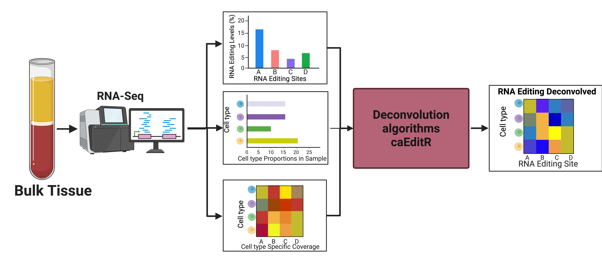

# caEditR - A suite of Tools for RNA editing cell type Deconvolution



MIT License (see `LICENSE`). 

Written by Haim Krupkin+Claude.

caEditR splits bulk RNA-editing ratios (sites x samples) into per-cell-type editing matrices, tests genetic effects on
editing in each cell type (cell-type edQTLs) directly on the bulk data, and rebuilds per-donor cell-type editing
matrices using those genetic effects.

## Install in R

```r
if (!requireNamespace("remotes", quietly = TRUE)) install.packages("remotes")
remotes::install_github("haimkru/caEditR", build_vignettes = TRUE)
```

## Example

Please read the vignettes and run them a single time, they should work end to end.

| vignette | contents |
|---|---|
| `vignette("caEditR")` | Introduction: simulate a cohort, deconvolve it with `caRD_edit()`, `caNRD_edit()` and `TCA_Like()`, score against the truth, then run on real GSE64655 PBMC data. |
| `vignette("caEditR_complete_workflow")` | Every exported function on simulated data with known truth: inputs (theta, proportions), deconvolution, cell-type edQTL testing (`celltype_edqtl()`, `caNRD_editQTL()` with its three engines, bootstrap), shrinkage and genotype-informed reconstruction. |

## Functions

| task | function | notes |
|---|---|---|
| site ids | `format_site_id()` | `"chrom:pos:strand"`, no `chr` prefix |
| site to gene, coverage from expression | `map_sites_to_genes()`, `build_coverage_from_expression()` | get "coverage" by using expression as proxy. |
| expression weights theta | `estimate_theta_nnls()` | A way to estimate the expression contribution using NNLS algorithm |
| cell-type proportions | `estimate_proportions_signature_matrix()` | NNLS against any signature matrix, a way to use NNLS to get cell type proportions |
| RNA shares, read noise | `compute_effective_weights()`, `binomial_tau2()` | a way to get RNA share and account for noise. |
| deconvolution with a reference | `caRD_edit()`, `load_reference()` | this lets us do cell type Deconvultion using a refrence |
| deconvolution without a reference | `caNRD_edit()` | Our method for "no refrence" RNA editing estimation  |
| earlier caNRD versions | `caNRDv0.5_edit()` (= `caNRD_edit(estimator = "moment")`; alias `caNRDv2_edit()`), `caNRDv0_edit()`, `caRDv0_edit()` | These are older versions of caNRD. Functionality stored, but they have bugs. |
| low-level caNRD steps | `estimate_no_reference_params()`, `deconvolve_site()` | These are mostly for development, they are used by caNRD |
| TCA baseline | `TCA_Like()` | Runs the published TCA method (CRAN `TCA` package) using cell-type proportions only. |
| cell-type edQTL test (quick) | `celltype_edqtl()` | Tests whether genotype affects editing in each cell type, weighting each cell type by proportions share of the RNA. Similar to interaction term.|
| cell-type edQTL test (main) | `caNRD_editQTL()` | Fits the full caNRD model, so it accounts for donor-to-donor variation in each cell type and for read-count noise. Engines: `"fast"`(default, uses heuristics), `"scan"`(fast, usefully for large cohorts), `"reference"`(most accurrate, slow) |
| parameter uncertainty | `caNRD_editQTL_bootstrap()` | Re-runs the edQTL fit by bootstraping and resampled donors to measure how uncertain the beta estimates are. |
| genotype-informed matrices | `caNRD_joint_reconstruction()` | Builds per-donor, per-cell-type editing matrices that keep each site's genetic effect in the cell type it belongs to. it has less leakyness then caNRD but requires genotypes and a large cohort |
| simulation | `simulate_reference_and_cohort()`, `simulate_reference()`, `simulate_proportions()`, `simulate_true_editing()`, `simulate_bulk()`, `simulate_bulk_expression()`, `simulate_edqtl_cohort()` | Generate simulated cohorts where the true answer is known, for testing, development, and benchmarking. `simulate_edqtl_cohort()` also simulates genotypes with real genetic effects. |

## Quick start: cell-type edQTLs on simulated data

```r
library(caEditR)
eq <- simulate_edqtl_cohort(n_donors = 600, n_sites_per_type = 5, n_variants = 5, seed = 1)
theta <- estimate_theta_nnls(eq$bulk_expression, eq$proportions)          # NNLS floor = 1e-3

# cis scan: every (site, variant) pair; the lead variant of each site is re-fitted exactly
scan <- caNRD_editQTL(eq$bulk_editing, eq$genotypes, eq$proportions, theta, theta_floor = 1e-3,
                      pairs = eq$pairs, coverage = eq$coverage, engine = "scan")
lead <- scan[scan$refined & scan$status == "tested", c("site_id", "variant_id", "celltype", "beta", "se", "p", "p_site")]
head(lead[order(lead$p), ])

# genotype-informed cell-type editing matrices from one variant per site
fit <- caNRD_editQTL(eq$bulk_editing, eq$genotypes, eq$proportions, theta, theta_floor = 1e-3,
                     pairs = unique(lead[, c("site_id", "variant_id")]), coverage = eq$coverage)
rec <- caNRD_joint_reconstruction(eq$bulk_editing, eq$genotypes, eq$proportions, theta, theta_floor = 1e-3,
                                  fit = fit, coverage = eq$coverage)
dim(rec$reconstructed$Monocytes)                                           # sites x donors
```

# For problems - please contant haim krupkin at: hkrupkin@stanford.edu
